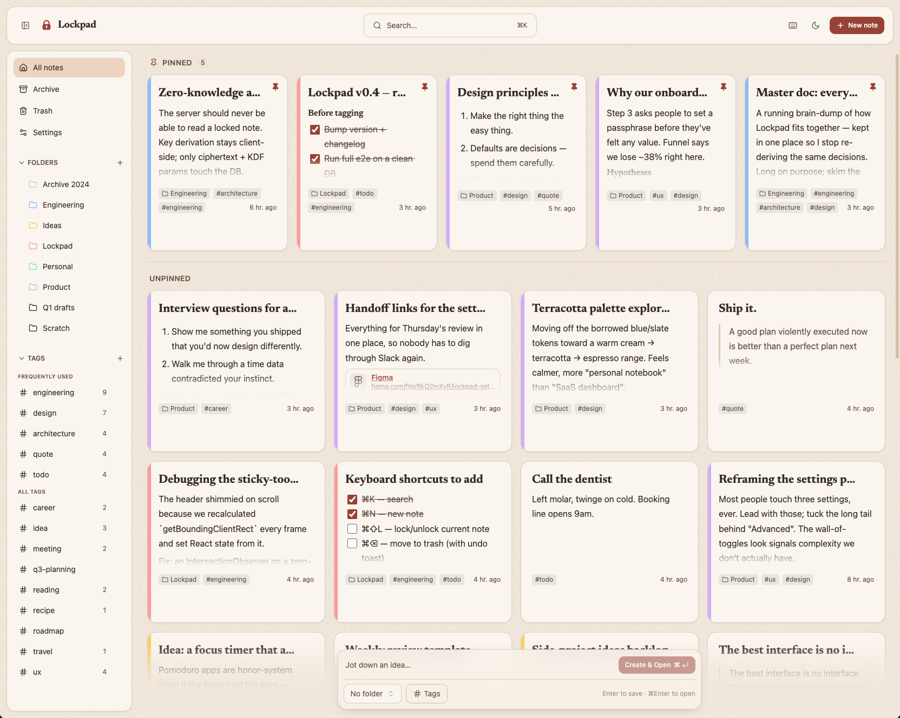
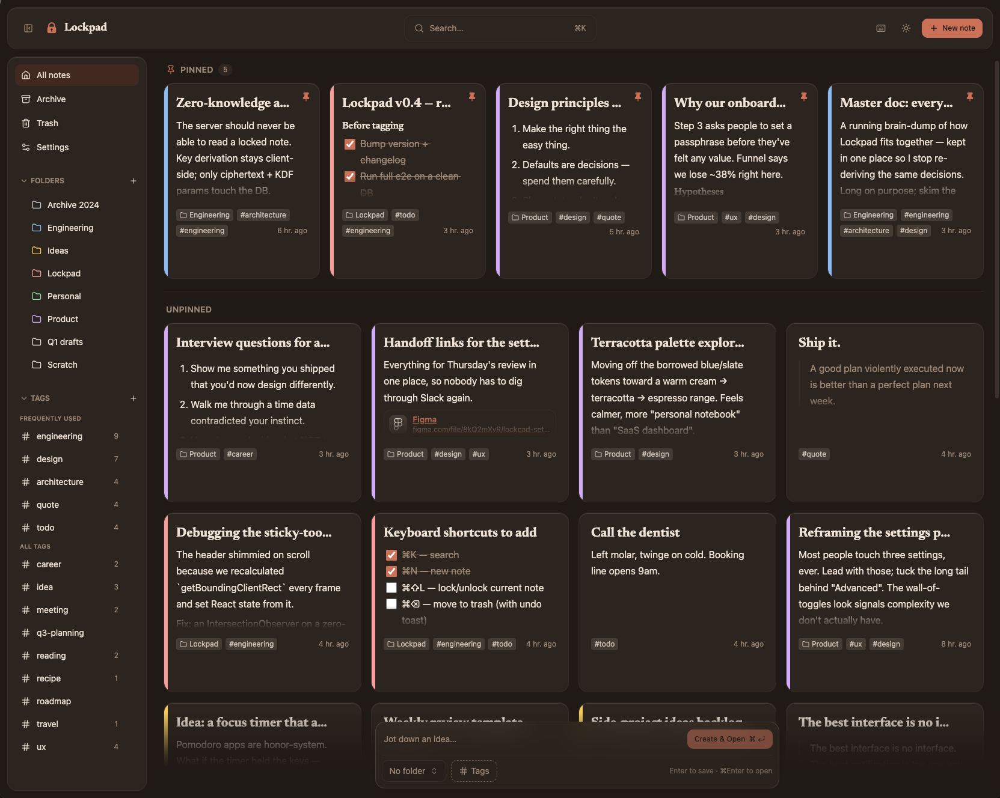
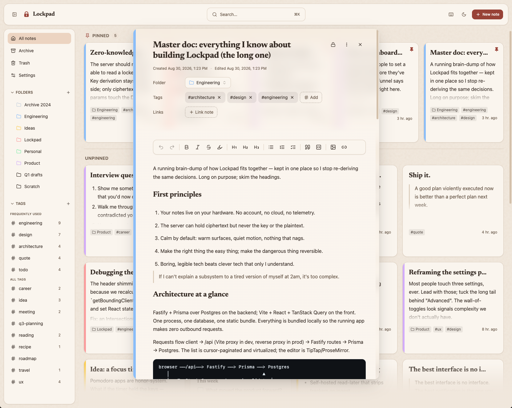

# 📓 Lockpad

Self-hosted, privacy-first notes. Runs entirely on hardware you own, and makes
**zero outbound network requests** — no analytics, no telemetry, no CDN fonts or
scripts, no external APIs. Notes you lock are encrypted in your browser; the server
only ever stores ciphertext for them.



▶ **[Watch the 50-second demo](docs/lockpad-demo.mp4)** — writing a note, filing it, and
locking one.

<!-- The link above opens GitHub's own video player, which is what a repo-relative video
     path does when this README is rendered on github.com. For an autoplaying player
     embedded directly in the page, GitHub only honours its own attachment CDN: drag
     docs/lockpad-demo.mp4 into the v1.0.0 Release (or any issue) to get a
     github.com/user-attachments/assets/… URL, then paste that URL on a line by itself
     here. A repo-relative path in a <video> tag will not render. -->

**Current release: v1.0.0 "Ganvié".** What is in it, and what changed since:
[CHANGELOG.md](CHANGELOG.md).

## 📦 Install

**Never used a terminal?** [SETUP.md](SETUP.md) walks through every install path step by
step, and [FAQ.md](FAQ.md) answers the questions that come up afterwards. The rest of this
page assumes you are comfortable with a shell.

You need [Docker](https://docs.docker.com/get-started/get-docker/) installed and
running. Then one command:

```bash
curl -fsSL https://raw.githubusercontent.com/Colbysdovi/Lockpad-Public/main/install.sh | bash
```

It generates the secrets, asks two questions — whether to set a login password, and
whether other devices on your network may reach it — starts everything, and prints
the address to open. Usually **http://localhost:5173**.

Database migrations run automatically on every start, so updating is just:

```bash
./scripts/backup.sh   # back up first; it takes a second
docker compose -f docker-compose.public.yml pull
docker compose -f docker-compose.public.yml up -d
```

**Settings → About** shows which version you're running and links to what changed.

### 🧱 From source

```bash
git clone https://github.com/Colbysdovi/Lockpad-Public.git lockpad
cd lockpad
cp .env.example .env        # set a strong POSTGRES_PASSWORD
docker compose build
docker compose up -d
```





## ✨ What it does

- **Rich text that stays out of the way** — headings, lists, checklists, quotes,
  code blocks with syntax highlighting, highlighter pens, images, and dividers.
  Type `/` for a command menu, or use Markdown shortcuts as you write.
- **Organise however you think** — nested folders, tags, and note-to-note links
  with backlinks. Pin notes per page, so a note pinned in one folder doesn't clutter
  another.
- **Full-text search** across everything, powered by Postgres.
- **Per-note encryption** — lock a note with a passphrase and it is encrypted in
  your browser with Argon2id + AES-GCM. The key and the plaintext never leave the
  tab. Someone with your database learns only that the note exists.
- **Import and export** — bring notes in from Google Keep, Standard Notes, HTML,
  Markdown, or CSV. Export the whole library as JSON, or one note as Markdown or PDF.
- **Yours offline** — installable as a web app, keyboard-driven, and equally usable
  on a phone.

## 🔒 Privacy

- **No outbound requests.** Fonts, icons and syntax highlighting are all bundled.
  Nothing is fetched from a CDN, and there is no analytics or telemetry of any kind.
  Lockpad does not even check for its own updates — that's a link you click.
- **Locked notes are end-to-end encrypted** client-side. The server stores
  ciphertext and key-derivation parameters, never the passphrase or the key.
- **Postgres is never exposed.** It has no host port at all; only the backend on the
  internal Docker network can reach it.
- **The frontend binds to `127.0.0.1` by default.** Reaching it from other devices is
  an explicit, documented choice — and if you pair it with no password, the app tells
  you so at startup and in **Settings → Security**.
- **Logs stay on your machine**, in a local volume.

## 📱 Reaching it from your phone

Don't port-forward. Put the machine on a [Tailscale](https://tailscale.com) network
and use `serve` — you get valid HTTPS on a private name, with nothing exposed to the
public internet:

```bash
tailscale serve --bg 127.0.0.1:5173
# → https://lockpad.<your-tailnet>.ts.net, reachable only by your own devices
```

Use `serve`, never `funnel` — `funnel` publishes to the internet. Restrict which
devices may connect with an ACL:

```jsonc
{
  "acls": [
    { "action": "accept", "src": ["autogroup:member"], "dst": ["tag:lockpad:443"] }
  ]
}
```

A ready-made sidecar is included: see `docker-compose.tailscale.yml`.

## 💾 Backups

Self-hosting means the backups are yours to keep.

```bash
./scripts/backup.sh                          # writes backups/lockpad-<timestamp>.sql.gz
./scripts/restore.sh backups/lockpad-….sql.gz
```

`backup.sh` keeps the last 14 dumps and is safe to run from cron. You can also
export the entire library as a single JSON file from **Settings → Data**, which is
the portable copy — though note that locked notes can't be exported while locked,
since the server only holds their ciphertext.

## 🧩 Architecture

```
┌─────────────┐     ┌───────────┐     ┌────────────┐
│  frontend   │────▶│  backend  │────▶│  postgres  │
│ Vite/React  │     │  Fastify  │     │  (internal │
│  (static)   │     │  Prisma   │     │   only)    │
└─────────────┘     └───────────┘     └────────────┘
        ▲
        │  tailscale serve (HTTPS, tailnet-only)
   your devices
```

- **frontend** — Vite + React SPA with TipTap for editing, built to static files and
  served by nginx, which also proxies `/api` so the browser only ever talks to one
  origin.
- **backend** — Fastify + Prisma, a plain JSON API. Applies its own migrations at
  startup.
- **postgres** — the official image, on an internal network with no host port.

## 💻 Developing

```bash
cd backend  && npm install && npm run dev:preview   # embedded Postgres, seeded demo library
cd frontend && npm install && npm run dev
```

`dev:preview` boots a throwaway Postgres, applies the real migrations, seeds a
realistic demo library and starts the actual API on `:4000` — nothing to install and
nothing left behind. Note that it re-seeds from scratch on every restart.

Run the backend test suite with `npm test` in `backend/`, and typecheck either side
with `npx tsc --noEmit`.

## 🤝 Contributing & security

See [CONTRIBUTING.md](CONTRIBUTING.md). For anything security-related, please read
[SECURITY.md](SECURITY.md) and report privately rather than opening an issue.

## 🚨 No warranty

Lockpad is software you run yourself, not a service someone operates for you. There is no
company behind it, no uptime commitment, no support contract and nobody on call. It is
provided as-is, without warranty of any kind, and the AGPL's own disclaimer of liability
applies in full.

In practice that means two things worth saying plainly. **Your backups are yours to keep** —
nobody else holds a copy of your notes, which is the entire point and also the catch; see
[FAQ.md](FAQ.md#-how-do-i-back-up-my-notes). And **a note you lock cannot be recovered
without its passphrase**, by you or by anyone else, because the key is derived from that
passphrase and never leaves your browser. That is the feature behaving correctly, which is
no comfort at all if you have lost the passphrase. Use a password manager.

## 📄 License

[GNU AGPL-3.0](LICENSE). You can run, modify and share Lockpad freely; if you run a
modified version as a network service, the AGPL asks you to publish those changes.
